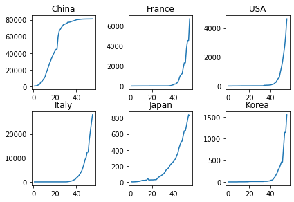
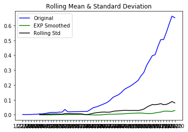
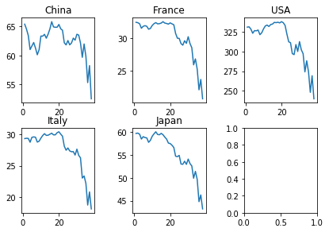
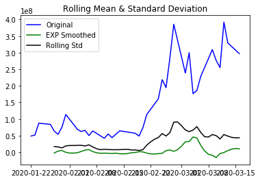
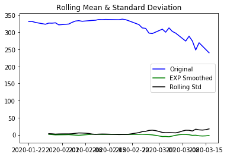
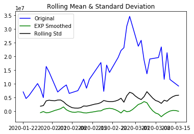
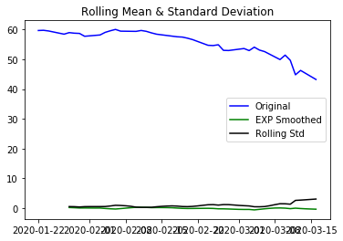
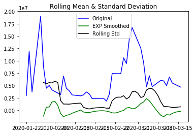
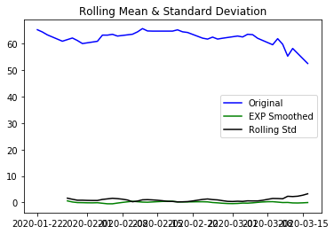
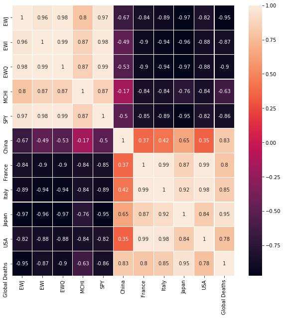

```python
import pandas as pd
import numpy as np
import matplotlib.pyplot as plt
import seaborn as sns
from statsmodels.tsa.vector_ar.var_model import VAR
from statsmodels.tsa.stattools import adfuller
```


```python
death_data = pd.read_csv('deaths.csv')
confirmed_data = pd.read_csv('confirmed.csv')
death_data = death_data.drop('Province/State', axis = 1)
confirmed_data = confirmed_data.drop('Province/State', axis = 1)
location_data = pd.DataFrame({'Country': confirmed_data['Country/Region'], 'Lat': confirmed_data['Lat'], 'Long' : confirmed_data['Long']}, columns=['Country', 'Lat', 'Long'])
location_data = location_data.groupby('Country').agg('mean')
```


```python
death_data = death_data.drop('Lat', axis = 1)
death_data = death_data.drop('Long', axis = 1)
confirmed_data = confirmed_data.drop('Lat', axis = 1)
confirmed_data = confirmed_data.drop('Long', axis = 1)
```


```python
confirmed_data = confirmed_data.groupby('Country/Region').agg('sum')
#confirmed_data = confirmed_data.join(location_data)
death_data = death_data.groupby('Country/Region').agg('sum')
#death_data = death_data.join(location_data)
```


```python
globalnum1 = confirmed_data.sum(axis=0).rename("Global")
globalnum2 = death_data.sum(axis=0).rename("Global")
countryfilter = confirmed_data.index.isin(["South Korea", "Italy", "China", "US", "Japan", "United Kingdom", "France", "Korea South", "Global"])
confirmed_data = confirmed_data[countryfilter]
death_data = death_data[countryfilter]

```


```python
# Dividie by population/100000 -> Each point represents 1/1000 of a percent
China = confirmed_data.iloc[0].divide(14377.22468)
France = confirmed_data.iloc[1].divide(652.73511)[2:]
Italy = confirmed_data.iloc[2].divide(604.87167)[9:]
Japan = confirmed_data.iloc[3].divide(1265.87521)
USA = confirmed_data.iloc[4].divide(3304.41184)
Korea = confirmed_data.iloc[5].divide(512.56069)
```


```python
confirmed_data = confirmed_data.append(globalnum1)
confirmed_data.head()
```


<div>
<style scoped>
    .dataframe tbody tr th:only-of-type {
        vertical-align: middle;
    }

    .dataframe tbody tr th {
        vertical-align: top;
    }

    .dataframe thead th {
        text-align: right;
    }
</style>
<table border="1" class="dataframe">
  <thead>
    <tr style="text-align: right;">
      <th></th>
      <th>1/22/20</th>
      <th>1/23/20</th>
      <th>1/24/20</th>
      <th>1/25/20</th>
      <th>1/26/20</th>
      <th>1/27/20</th>
      <th>1/28/20</th>
      <th>1/29/20</th>
      <th>1/30/20</th>
      <th>1/31/20</th>
      <th>...</th>
      <th>3/7/20</th>
      <th>3/8/20</th>
      <th>3/9/20</th>
      <th>3/10/20</th>
      <th>3/11/20</th>
      <th>3/12/20</th>
      <th>3/13/20</th>
      <th>3/14/20</th>
      <th>3/15/20</th>
      <th>3/16/20</th>
    </tr>
    <tr>
      <th>Country/Region</th>
      <th></th>
      <th></th>
      <th></th>
      <th></th>
      <th></th>
      <th></th>
      <th></th>
      <th></th>
      <th></th>
      <th></th>
      <th></th>
      <th></th>
      <th></th>
      <th></th>
      <th></th>
      <th></th>
      <th></th>
      <th></th>
      <th></th>
      <th></th>
      <th></th>
    </tr>
  </thead>
  <tbody>
    <tr>
      <th>China</th>
      <td>548</td>
      <td>643</td>
      <td>920</td>
      <td>1406</td>
      <td>2075</td>
      <td>2877</td>
      <td>5509</td>
      <td>6087</td>
      <td>8141</td>
      <td>9802</td>
      <td>...</td>
      <td>80770</td>
      <td>80823</td>
      <td>80860</td>
      <td>80887</td>
      <td>80921</td>
      <td>80932</td>
      <td>80945</td>
      <td>80977</td>
      <td>81003</td>
      <td>81033</td>
    </tr>
    <tr>
      <th>France</th>
      <td>0</td>
      <td>0</td>
      <td>2</td>
      <td>3</td>
      <td>3</td>
      <td>3</td>
      <td>4</td>
      <td>5</td>
      <td>5</td>
      <td>5</td>
      <td>...</td>
      <td>957</td>
      <td>1134</td>
      <td>1217</td>
      <td>1792</td>
      <td>2289</td>
      <td>2289</td>
      <td>3672</td>
      <td>4480</td>
      <td>4513</td>
      <td>6650</td>
    </tr>
    <tr>
      <th>Italy</th>
      <td>0</td>
      <td>0</td>
      <td>0</td>
      <td>0</td>
      <td>0</td>
      <td>0</td>
      <td>0</td>
      <td>0</td>
      <td>0</td>
      <td>2</td>
      <td>...</td>
      <td>5883</td>
      <td>7375</td>
      <td>9172</td>
      <td>10149</td>
      <td>12462</td>
      <td>12462</td>
      <td>17660</td>
      <td>21157</td>
      <td>24747</td>
      <td>27980</td>
    </tr>
    <tr>
      <th>Japan</th>
      <td>2</td>
      <td>1</td>
      <td>2</td>
      <td>2</td>
      <td>4</td>
      <td>4</td>
      <td>7</td>
      <td>7</td>
      <td>11</td>
      <td>15</td>
      <td>...</td>
      <td>461</td>
      <td>502</td>
      <td>511</td>
      <td>581</td>
      <td>639</td>
      <td>639</td>
      <td>701</td>
      <td>773</td>
      <td>839</td>
      <td>825</td>
    </tr>
    <tr>
      <th>US</th>
      <td>1</td>
      <td>1</td>
      <td>2</td>
      <td>2</td>
      <td>5</td>
      <td>5</td>
      <td>5</td>
      <td>5</td>
      <td>5</td>
      <td>7</td>
      <td>...</td>
      <td>402</td>
      <td>518</td>
      <td>583</td>
      <td>959</td>
      <td>1281</td>
      <td>1663</td>
      <td>2179</td>
      <td>2727</td>
      <td>3499</td>
      <td>4632</td>
    </tr>
  </tbody>
</table>
<p>5 rows × 55 columns</p>
</div>


```python
death_data = death_data.append(globalnum2)
death_data.head()
```


<div>
<style scoped>
    .dataframe tbody tr th:only-of-type {
        vertical-align: middle;
    }

    .dataframe tbody tr th {
        vertical-align: top;
    }

    .dataframe thead th {
        text-align: right;
    }
</style>
<table border="1" class="dataframe">
  <thead>
    <tr style="text-align: right;">
      <th></th>
      <th>1/22/20</th>
      <th>1/23/20</th>
      <th>1/24/20</th>
      <th>1/25/20</th>
      <th>1/26/20</th>
      <th>1/27/20</th>
      <th>1/28/20</th>
      <th>1/29/20</th>
      <th>1/30/20</th>
      <th>1/31/20</th>
      <th>...</th>
      <th>3/7/20</th>
      <th>3/8/20</th>
      <th>3/9/20</th>
      <th>3/10/20</th>
      <th>3/11/20</th>
      <th>3/12/20</th>
      <th>3/13/20</th>
      <th>3/14/20</th>
      <th>3/15/20</th>
      <th>3/16/20</th>
    </tr>
    <tr>
      <th>Country/Region</th>
      <th></th>
      <th></th>
      <th></th>
      <th></th>
      <th></th>
      <th></th>
      <th></th>
      <th></th>
      <th></th>
      <th></th>
      <th></th>
      <th></th>
      <th></th>
      <th></th>
      <th></th>
      <th></th>
      <th></th>
      <th></th>
      <th></th>
      <th></th>
      <th></th>
    </tr>
  </thead>
  <tbody>
    <tr>
      <th>China</th>
      <td>17</td>
      <td>18</td>
      <td>26</td>
      <td>42</td>
      <td>56</td>
      <td>82</td>
      <td>131</td>
      <td>133</td>
      <td>171</td>
      <td>213</td>
      <td>...</td>
      <td>3072</td>
      <td>3100</td>
      <td>3123</td>
      <td>3139</td>
      <td>3161</td>
      <td>3172</td>
      <td>3180</td>
      <td>3193</td>
      <td>3203</td>
      <td>3217</td>
    </tr>
    <tr>
      <th>France</th>
      <td>0</td>
      <td>0</td>
      <td>0</td>
      <td>0</td>
      <td>0</td>
      <td>0</td>
      <td>0</td>
      <td>0</td>
      <td>0</td>
      <td>0</td>
      <td>...</td>
      <td>11</td>
      <td>19</td>
      <td>19</td>
      <td>33</td>
      <td>48</td>
      <td>48</td>
      <td>79</td>
      <td>91</td>
      <td>91</td>
      <td>148</td>
    </tr>
    <tr>
      <th>Italy</th>
      <td>0</td>
      <td>0</td>
      <td>0</td>
      <td>0</td>
      <td>0</td>
      <td>0</td>
      <td>0</td>
      <td>0</td>
      <td>0</td>
      <td>0</td>
      <td>...</td>
      <td>233</td>
      <td>366</td>
      <td>463</td>
      <td>631</td>
      <td>827</td>
      <td>827</td>
      <td>1266</td>
      <td>1441</td>
      <td>1809</td>
      <td>2158</td>
    </tr>
    <tr>
      <th>Japan</th>
      <td>0</td>
      <td>0</td>
      <td>0</td>
      <td>0</td>
      <td>0</td>
      <td>0</td>
      <td>0</td>
      <td>0</td>
      <td>0</td>
      <td>0</td>
      <td>...</td>
      <td>6</td>
      <td>6</td>
      <td>10</td>
      <td>10</td>
      <td>15</td>
      <td>16</td>
      <td>19</td>
      <td>22</td>
      <td>22</td>
      <td>27</td>
    </tr>
    <tr>
      <th>US</th>
      <td>0</td>
      <td>0</td>
      <td>0</td>
      <td>0</td>
      <td>0</td>
      <td>0</td>
      <td>0</td>
      <td>0</td>
      <td>0</td>
      <td>0</td>
      <td>...</td>
      <td>17</td>
      <td>21</td>
      <td>22</td>
      <td>28</td>
      <td>36</td>
      <td>40</td>
      <td>47</td>
      <td>54</td>
      <td>63</td>
      <td>85</td>
    </tr>
  </tbody>
</table>
<p>5 rows × 55 columns</p>
</div>


```python
fig,a =  plt.subplots(2,3)
x = np.arange(1,5)
fig.tight_layout()
a[0][0].plot(range(1,56), confirmed_data.iloc[0])
a[0][0].set_title('China')
a[0][1].plot(range(1,56), confirmed_data.iloc[1])
a[0][1].set_title('France')
a[1][0].plot(range(1,56), confirmed_data.iloc[2])
a[1][0].set_title('Italy')
a[1][1].plot(range(1,56), confirmed_data.iloc[3])
a[1][1].set_title('Japan')
a[0][2].plot(range(1,56), confirmed_data.iloc[4])
a[0][2].set_title('USA')
a[1][2].plot(range(1,56), confirmed_data.iloc[5])
a[1][2].set_title('Korea')
plt.show()

```





```python
# Dickey Fuller Test for stationarity
def test_stationarity(timeseries):
    
    #Determing rolling statistics
    ema = timeseries.ewm(4).mean()
    rolmean = timeseries.rolling(7).mean()
    stat = rolmean-ema
    rolstd = timeseries.rolling(7).std()
    #Plot rolling statistics:
    plt.plot(timeseries, color='blue',label='Original')
    #plt.plot(rolmean, color='red', label='Rolling Mean')
    plt.plot(stat, color= 'green', label = 'EXP Smoothed')
    plt.plot(rolstd, color='black', label = 'Rolling Std')
    plt.legend(loc='best')
    plt.title('Rolling Mean & Standard Deviation')
    plt.show()
    #Perform Dickey-Fuller test:
    print ('Results of Dickey-Fuller Test:')
    dftest = adfuller(timeseries, autolag='AIC')
    dfoutput = pd.Series(dftest[0:4], index=['Test Statistic','p-value','#Lags Used','Number of Observations Used'])
    for key,value in dftest[4].items():
        dfoutput['Critical Value (%s)'%key] = value
    return ema

# Make timeseries stationary
def make_stationary(timeseries):
    new_timeseries = []
    ema = timeseries.ewm(4).mean()
    rolmean = timeseries.rolling(7).mean()
    stat = rolmean-ema
    for i in range(0, 6):
        stat[i] = timeseries[i]
    return stat

def get_ema(timeseries):
    return timeseries.ewm(4).mean()
```


```python
test_stationarity(Japan)
```





    Results of Dickey-Fuller Test:


    1/22/20    0.001580
    1/23/20    0.001141
    1/24/20    0.001321
    1/25/20    0.001409
    1/26/20    0.001930
    1/27/20    0.002263
    1/28/20    0.003090
    1/29/20    0.003676
    1/30/20    0.004834
    1/31/20    0.006406
    2/1/20     0.008461
    2/2/20     0.010037
    2/3/20     0.011257
    2/4/20     0.012538
    2/5/20     0.013541
    2/6/20     0.018070
    2/7/20     0.018414
    2/8/20     0.018686
    2/9/20     0.019062
    2/10/20    0.019361
    2/11/20    0.019599
    2/12/20    0.020106
    2/13/20    0.020511
    2/14/20    0.020993
    2/15/20    0.023598
    2/16/20    0.028214
    2/17/20    0.033010
    2/18/20    0.038110
    2/19/20    0.043768
    2/20/20    0.049873
    2/21/20    0.056495
    2/22/20    0.064477
    2/23/20    0.074813
    2/24/20    0.084977
    2/25/20    0.094844
    2/26/20    0.105740
    2/27/20    0.118406
    2/28/20    0.130750
    2/29/20    0.142678
    3/1/20     0.154590
    3/2/20     0.166964
    3/3/20     0.179864
    3/4/20     0.196188
    3/5/20     0.213829
    3/6/20     0.237422
    3/7/20     0.262773
    3/8/20     0.289532
    3/9/20     0.312361
    3/10/20    0.341683
    3/11/20    0.374305
    3/12/20    0.400402
    3/13/20    0.431075
    3/14/20    0.466990
    3/15/20    0.506148
    3/16/20    0.535263
    Name: Japan, dtype: float64


```python
ewi = pd.read_csv('EWI.csv').transpose()
spy = pd.read_csv('SPY.csv').transpose()
ewq = pd.read_csv('EWQ.csv').transpose()
mchi = pd.read_csv('MCHI.csv').transpose()
ewj = pd.read_csv('EWJ.csv').transpose()
```


```python
cols = range(0,214)
ewi.drop(ewi.columns[cols],axis=1,inplace=True)
spy.drop(spy.columns[cols],axis=1,inplace=True)
ewq.drop(ewq.columns[cols],axis=1,inplace=True)
mchi.drop(mchi.columns[cols],axis=1,inplace=True)
ewj.drop(ewj.columns[cols],axis=1,inplace=True)
ewj.drop([ewj.index[1], ewj.index[2], ewj.index[3], ewj.index[4]], axis = 0, inplace=True)
spy.drop([spy.index[1], spy.index[2], spy.index[3], spy.index[4]], axis = 0, inplace=True)
ewi.drop([ewi.index[1], ewi.index[2], ewi.index[3], ewi.index[4]], axis = 0, inplace=True)
mchi.drop([mchi.index[1], mchi.index[2], mchi.index[3], mchi.index[4]], axis = 0, inplace=True)
ewq.drop([ewq.index[1], ewq.index[2], ewq.index[3], ewq.index[4]], axis = 0, inplace=True)
```


```python
ewi = ewi.replace('\d\d\d\d-', '', regex=True).replace('\d1-', '1-', regex=True).replace('\d2-', '2-', regex=True).replace('\d3-', '3-', regex=True).replace('-', '/', regex=True)
ewi.iloc[0] = ewi.iloc[0]+'/20'
mchi = mchi.replace('\d\d\d\d-', '', regex=True).replace('\d1-', '1-', regex=True).replace('\d2-', '2-', regex=True).replace('\d3-', '3-', regex=True).replace('-', '/', regex=True)
mchi.iloc[0] = mchi.iloc[0]+'/20'
ewj = ewj.replace('\d\d\d\d-', '', regex=True).replace('\d1-', '1-', regex=True).replace('\d2-', '2-', regex=True).replace('\d3-', '3-', regex=True).replace('-', '/', regex=True)
ewj.iloc[0] = ewj.iloc[0]+'/20'
spy = spy.replace('\d\d\d\d-', '', regex=True).replace('\d1-', '1-', regex=True).replace('\d2-', '2-', regex=True).replace('\d3-', '3-', regex=True).replace('-', '/', regex=True)
spy.iloc[0] = spy.iloc[0]+'/20'
ewq = ewq.replace('\d\d\d\d-', '', regex=True).replace('\d1-', '1-', regex=True).replace('\d2-', '2-', regex=True).replace('\d3-', '3-', regex=True).replace('-', '/', regex=True)
ewq.iloc[0] = ewq.iloc[0]+'/20'

```


```python
ewi.columns = ewi.iloc[0]
ewi = ewi.drop('Date',axis = 0)
ewi = ewi.drop(['3/17/20','3/18/20'], axis = 1)

ewq.columns = ewq.iloc[0]
ewq = ewq.drop('Date',axis = 0)
ewq = ewq.drop(['3/17/20','3/18/20'], axis = 1)

ewj.columns = ewj.iloc[0]
ewj = ewj.drop('Date',axis = 0)
ewj = ewj.drop(['3/17/20','3/18/20'], axis = 1)

spy.columns = spy.iloc[0]
spy = spy.drop('Date',axis = 0)
spy = spy.drop(['3/17/20','3/18/20'], axis = 1)

mchi.columns = mchi.iloc[0]
mchi = mchi.drop('Date',axis = 0)
mchi = mchi.drop(['3/17/20','3/18/20'], axis = 1)
```


```python
fig,a =  plt.subplots(2,3)
x = np.arange(1,5)
fig.tight_layout()
a[0][0].plot(range(1,39), mchi.iloc[0])
a[0][0].set_title('China')
a[0][1].plot(range(1,39), ewq.iloc[0])
a[0][1].set_title('France')
a[1][0].plot(range(1,39), ewi.iloc[0])
a[1][0].set_title('Italy')
a[1][1].plot(range(1,39), ewj.iloc[0])
a[1][1].set_title('Japan')
a[0][2].plot(range(1,39), spy.iloc[0])
a[0][2].set_title('USA')
plt.show()

```





```python
confirmed_data.transpose().columns.name='Date'
```


```python
def find_increment(prev, next, count):
    return ((next-prev)/(count+1))

def fill_series(series):
    prev = 0;
    next = series[0];
    count = 0;
    i = 0;
    while i < series.size:
        if series[i] == 0:
            count = count + 1
        elif count != 0:
            prev = next
            next = series[i]
            next = series[i]
            increment = find_increment(prev, next, count)
            add = increment
            while count != 0:
                # set previous values 
                series[i-count] = prev + add
                add += increment
                count = count - 1
            count = 0
            prev = next
            next = series[i]
        else:
            prev = next;
            next = series[i]
        i = i + 1
```


```python
dates = pd.date_range('01/22/2020', '03/16/2020')
#SPY
spy_price = pd.Series(spy.iloc[0])
spy_price.index = pd.DatetimeIndex(spy_price.index)
spy_price = spy_price.reindex(dates, fill_value=0)
fill_series(spy_price)
spy_vol = pd.Series(spy.iloc[1])
spy_vol.index = pd.DatetimeIndex(spy_vol.index)
spy_vol = spy_vol.reindex(dates, fill_value=0)
fill_series(spy_price)
fill_series(spy_vol)
#EWQ
ewq_price = pd.Series(ewq.iloc[0])
ewq_price.index = pd.DatetimeIndex(ewq_price.index)
ewq_price = ewq_price.reindex(dates, fill_value=0)
fill_series(ewq_price)
ewq_vol = pd.Series(ewq.iloc[1])
ewq_vol.index = pd.DatetimeIndex(ewq_vol.index)
ewq_vol = ewq_vol.reindex(dates, fill_value=0)
fill_series(ewq_vol)
#EWJ
ewj_price = pd.Series(ewj.iloc[0])
ewj_price.index = pd.DatetimeIndex(ewj_price.index)
ewj_price = ewj_price.reindex(dates, fill_value=0)
fill_series(ewj_price)
ewj_vol = pd.Series(ewj.iloc[1])
ewj_vol.index = pd.DatetimeIndex(ewj_vol.index)
ewj_vol = ewj_vol.reindex(dates, fill_value=0)
fill_series(ewj_vol)
#EWI
ewi_price = pd.Series(ewi.iloc[0])
ewi_price.index = pd.DatetimeIndex(ewi_price.index)
ewi_price = ewi_price.reindex(dates, fill_value=0)
fill_series(ewi_price)
ewi_vol = pd.Series(ewi.iloc[1])
ewi_vol.index = pd.DatetimeIndex(ewi_vol.index)
ewi_vol = ewi_vol.reindex(dates, fill_value=0)
fill_series(ewi_vol)
#MCHI
mchi_price = pd.Series(mchi.iloc[0])
mchi_price.index = pd.DatetimeIndex(mchi_price.index)
mchi_price = mchi_price.reindex(dates, fill_value=0)
fill_series(mchi_price)
mchi_vol = pd.Series(mchi.iloc[1])
mchi_vol.index = pd.DatetimeIndex(mchi_vol.index)
mchi_vol = mchi_vol.reindex(dates, fill_value=0)
fill_series(mchi_vol)

```


```python
spy = pd.concat([spy_price, spy_vol], axis=1)
ewq = pd.concat([ewq_price, ewq_vol], axis=1)
ewi = pd.concat([ewi_price, ewi_vol], axis=1)
ewj = pd.concat([ewj_price, ewj_vol], axis=1)
mchi = pd.concat([mchi_price, mchi_vol], axis=1)

```


```python
# Reasonably stationary for EWJ, but not too stationary for SPY and MCHI
# Stretch goal: Try other forms of smoothing; exponential smoothing generates too many sharp changes in SPY/MCHI
test_stationarity(spy.iloc[:,1])
test_stationarity(spy.iloc[:,0])
test_stationarity(ewj.iloc[:,1])
test_stationarity(ewj.iloc[:,0])
test_stationarity(mchi.iloc[:,1])
test_stationarity(mchi.iloc[:,0])

```





    Results of Dickey-Fuller Test:





    Results of Dickey-Fuller Test:





    Results of Dickey-Fuller Test:





    Results of Dickey-Fuller Test:





    Results of Dickey-Fuller Test:





    Results of Dickey-Fuller Test:


    2020-01-22    65.349998
    2020-01-23    64.877777
    2020-01-24    64.272131
    2020-01-25    63.705692
    2020-01-26    63.138792
    2020-01-27    62.559060
    2020-01-28    62.318879
    2020-01-29    62.292713
    2020-01-30    62.054151
    2020-01-31    61.618548
    2020-02-01    61.351208
    2020-02-02    61.207777
    2020-02-03    61.157455
    2020-02-04    61.607769
    2020-02-05    61.958557
    2020-02-06    62.298412
    2020-02-07    62.431732
    2020-02-08    62.584131
    2020-02-09    62.751720
    2020-02-10    62.931448
    2020-02-11    63.254134
    2020-02-12    63.763063
    2020-02-13    63.987776
    2020-02-14    64.155010
    2020-02-15    64.288513
    2020-02-16    64.395132
    2020-02-17    64.480312
    2020-02-18    64.548381
    2020-02-19    64.698939
    2020-02-20    64.671116
    2020-02-21    64.598821
    2020-02-22    64.397564
    2020-02-23    64.093191
    2020-02-24    63.706357
    2020-02-25    63.324930
    2020-02-26    63.169894
    2020-02-27    62.897845
    2020-02-28    62.744244
    2020-02-29    62.676717
    2020-03-01    62.678041
    2020-03-02    62.734438
    2020-03-03    62.709549
    2020-03-04    62.891651
    2020-03-05    63.009327
    2020-03-06    62.829454
    2020-03-07    62.522886
    2020-03-08    62.114964
    2020-03-09    61.625960
    2020-03-10    61.692769
    2020-03-11    61.322210
    2020-03-12    60.125754
    2020-03-13    59.752600
    2020-03-14    59.074741
    2020-03-15    58.153121
    2020-03-16    57.036491
    Freq: D, Name: Adj Close, dtype: float64


```python
# Modeling Japan
data = pd.concat([make_stationary(ewj.iloc[:,0]), make_stationary(ewj.iloc[:,1]), make_stationary(death_data.iloc[3]),
                  make_stationary(Japan).astype(float)], axis=1)

# Fitting the VAR Model
model = VAR(data)
model_fit = model.fit()
ewj_pred = model_fit.forecast(model_fit.y, steps=1)

```

    /opt/anaconda3/lib/python3.7/site-packages/statsmodels/base/wrapper.py:36: FutureWarning: y is a deprecated alias for endog, will be removed in version 0.11.0
      obj = getattr(results, attr)


```python
ewj_pred[0][0] + get_ema(ewj.iloc[:,0])[-1] # Predicted 51.1304 EWJ
```


    51.13042226758046


```python
corona_data = confirmed_data.transpose()
df = data = pd.concat([ewj.iloc[:,0].astype(float), ewi.iloc[:,0].astype(float), ewq.iloc[:,0].astype(float),
                       mchi.iloc[:,0].astype(float), spy.iloc[:,0].astype(float), 
                      corona_data.iloc[:,0], corona_data.iloc[:,1], corona_data.iloc[:,2], corona_data.iloc[:,3], 
                      corona_data.iloc[:,4], death_data.transpose().iloc[:,6]], axis=1)
#df = df.rename(columns ={"Global" : "Deaths"})
#df.rename(columns={df.columns[0]: "EWJ" }, inplace = True)
df.columns = ['EWJ', 'EWI','EWQ','MCHI', 'SPY', 'China', 'France', 'Italy', 'Japan', 'USA', 'Global Deaths']

```


```python
df
```


<div>
<style scoped>
    .dataframe tbody tr th:only-of-type {
        vertical-align: middle;
    }

    .dataframe tbody tr th {
        vertical-align: top;
    }

    .dataframe thead th {
        text-align: right;
    }
</style>
<table border="1" class="dataframe">
  <thead>
    <tr style="text-align: right;">
      <th></th>
      <th>EWJ</th>
      <th>EWI</th>
      <th>EWQ</th>
      <th>MCHI</th>
      <th>SPY</th>
      <th>China</th>
      <th>France</th>
      <th>Italy</th>
      <th>Japan</th>
      <th>USA</th>
      <th>Global Deaths</th>
    </tr>
  </thead>
  <tbody>
    <tr>
      <th>2020-01-22</th>
      <td>59.689999</td>
      <td>29.340000</td>
      <td>32.470001</td>
      <td>65.349998</td>
      <td>331.339996</td>
      <td>548</td>
      <td>0</td>
      <td>0</td>
      <td>2</td>
      <td>1</td>
      <td>17</td>
    </tr>
    <tr>
      <th>2020-01-23</th>
      <td>59.759998</td>
      <td>29.389999</td>
      <td>32.410000</td>
      <td>64.500000</td>
      <td>331.720001</td>
      <td>643</td>
      <td>0</td>
      <td>0</td>
      <td>1</td>
      <td>1</td>
      <td>18</td>
    </tr>
    <tr>
      <th>2020-01-24</th>
      <td>59.529999</td>
      <td>29.370001</td>
      <td>32.250000</td>
      <td>63.400002</td>
      <td>328.769989</td>
      <td>920</td>
      <td>2</td>
      <td>0</td>
      <td>2</td>
      <td>2</td>
      <td>26</td>
    </tr>
    <tr>
      <th>2020-01-25</th>
      <td>59.173332</td>
      <td>29.166667</td>
      <td>32.016666</td>
      <td>62.600001</td>
      <td>327.013326</td>
      <td>1406</td>
      <td>3</td>
      <td>0</td>
      <td>2</td>
      <td>2</td>
      <td>42</td>
    </tr>
    <tr>
      <th>2020-01-26</th>
      <td>58.816666</td>
      <td>28.963334</td>
      <td>31.783333</td>
      <td>61.800001</td>
      <td>325.256663</td>
      <td>2075</td>
      <td>3</td>
      <td>0</td>
      <td>4</td>
      <td>5</td>
      <td>56</td>
    </tr>
    <tr>
      <th>2020-01-27</th>
      <td>58.459999</td>
      <td>28.760000</td>
      <td>31.549999</td>
      <td>61.000000</td>
      <td>323.500000</td>
      <td>2877</td>
      <td>3</td>
      <td>0</td>
      <td>4</td>
      <td>5</td>
      <td>82</td>
    </tr>
    <tr>
      <th>2020-01-28</th>
      <td>58.980000</td>
      <td>29.540001</td>
      <td>31.850000</td>
      <td>61.610001</td>
      <td>326.890015</td>
      <td>5509</td>
      <td>4</td>
      <td>0</td>
      <td>7</td>
      <td>5</td>
      <td>131</td>
    </tr>
    <tr>
      <th>2020-01-29</th>
      <td>58.790001</td>
      <td>29.610001</td>
      <td>31.950001</td>
      <td>62.209999</td>
      <td>326.619995</td>
      <td>6087</td>
      <td>5</td>
      <td>0</td>
      <td>7</td>
      <td>5</td>
      <td>133</td>
    </tr>
    <tr>
      <th>2020-01-30</th>
      <td>58.709999</td>
      <td>29.559999</td>
      <td>31.850000</td>
      <td>61.259998</td>
      <td>327.679993</td>
      <td>8141</td>
      <td>5</td>
      <td>0</td>
      <td>11</td>
      <td>5</td>
      <td>171</td>
    </tr>
    <tr>
      <th>2020-01-31</th>
      <td>57.750000</td>
      <td>28.780001</td>
      <td>31.400000</td>
      <td>60.110001</td>
      <td>321.730011</td>
      <td>9802</td>
      <td>5</td>
      <td>2</td>
      <td>15</td>
      <td>7</td>
      <td>213</td>
    </tr>
    <tr>
      <th>2020-02-01</th>
      <td>57.896666</td>
      <td>28.826667</td>
      <td>31.440000</td>
      <td>60.396668</td>
      <td>322.526672</td>
      <td>11891</td>
      <td>6</td>
      <td>2</td>
      <td>20</td>
      <td>8</td>
      <td>259</td>
    </tr>
    <tr>
      <th>2020-02-02</th>
      <td>58.043333</td>
      <td>28.873334</td>
      <td>31.480000</td>
      <td>60.683334</td>
      <td>323.323334</td>
      <td>16630</td>
      <td>6</td>
      <td>2</td>
      <td>20</td>
      <td>8</td>
      <td>362</td>
    </tr>
    <tr>
      <th>2020-02-03</th>
      <td>58.189999</td>
      <td>28.920000</td>
      <td>31.520000</td>
      <td>60.970001</td>
      <td>324.119995</td>
      <td>19716</td>
      <td>6</td>
      <td>2</td>
      <td>20</td>
      <td>11</td>
      <td>426</td>
    </tr>
    <tr>
      <th>2020-02-04</th>
      <td>59.070000</td>
      <td>29.420000</td>
      <td>31.980000</td>
      <td>63.310001</td>
      <td>329.059998</td>
      <td>23707</td>
      <td>6</td>
      <td>2</td>
      <td>22</td>
      <td>11</td>
      <td>492</td>
    </tr>
    <tr>
      <th>2020-02-05</th>
      <td>59.599998</td>
      <td>29.830000</td>
      <td>32.259998</td>
      <td>63.299999</td>
      <td>332.859985</td>
      <td>27440</td>
      <td>6</td>
      <td>2</td>
      <td>22</td>
      <td>11</td>
      <td>564</td>
    </tr>
    <tr>
      <th>2020-02-06</th>
      <td>60.049999</td>
      <td>30.129999</td>
      <td>32.419998</td>
      <td>63.610001</td>
      <td>333.980011</td>
      <td>30587</td>
      <td>6</td>
      <td>2</td>
      <td>45</td>
      <td>11</td>
      <td>634</td>
    </tr>
    <tr>
      <th>2020-02-07</th>
      <td>59.470001</td>
      <td>29.850000</td>
      <td>32.230000</td>
      <td>62.950001</td>
      <td>332.200012</td>
      <td>34110</td>
      <td>6</td>
      <td>3</td>
      <td>25</td>
      <td>11</td>
      <td>719</td>
    </tr>
    <tr>
      <th>2020-02-08</th>
      <td>59.446668</td>
      <td>29.860000</td>
      <td>32.239999</td>
      <td>63.180000</td>
      <td>333.026672</td>
      <td>36814</td>
      <td>11</td>
      <td>3</td>
      <td>25</td>
      <td>11</td>
      <td>806</td>
    </tr>
    <tr>
      <th>2020-02-09</th>
      <td>59.423335</td>
      <td>29.869999</td>
      <td>32.249999</td>
      <td>63.410000</td>
      <td>333.853333</td>
      <td>39829</td>
      <td>11</td>
      <td>3</td>
      <td>26</td>
      <td>11</td>
      <td>906</td>
    </tr>
    <tr>
      <th>2020-02-10</th>
      <td>59.400002</td>
      <td>29.879999</td>
      <td>32.259998</td>
      <td>63.639999</td>
      <td>334.679993</td>
      <td>42354</td>
      <td>11</td>
      <td>3</td>
      <td>26</td>
      <td>11</td>
      <td>1013</td>
    </tr>
    <tr>
      <th>2020-02-11</th>
      <td>59.700001</td>
      <td>30.040001</td>
      <td>32.349998</td>
      <td>64.529999</td>
      <td>335.260010</td>
      <td>44386</td>
      <td>11</td>
      <td>3</td>
      <td>26</td>
      <td>12</td>
      <td>1113</td>
    </tr>
    <tr>
      <th>2020-02-12</th>
      <td>59.410000</td>
      <td>30.200001</td>
      <td>32.570000</td>
      <td>65.779999</td>
      <td>337.420013</td>
      <td>44759</td>
      <td>11</td>
      <td>3</td>
      <td>28</td>
      <td>12</td>
      <td>1118</td>
    </tr>
    <tr>
      <th>2020-02-13</th>
      <td>58.889999</td>
      <td>29.940001</td>
      <td>32.349998</td>
      <td>64.879997</td>
      <td>337.059998</td>
      <td>59895</td>
      <td>11</td>
      <td>3</td>
      <td>28</td>
      <td>13</td>
      <td>1371</td>
    </tr>
    <tr>
      <th>2020-02-14</th>
      <td>58.450001</td>
      <td>29.940001</td>
      <td>32.290001</td>
      <td>64.820000</td>
      <td>337.600006</td>
      <td>66358</td>
      <td>11</td>
      <td>3</td>
      <td>29</td>
      <td>13</td>
      <td>1523</td>
    </tr>
    <tr>
      <th>2020-02-15</th>
      <td>58.232501</td>
      <td>30.025001</td>
      <td>32.265000</td>
      <td>64.820000</td>
      <td>337.382507</td>
      <td>68413</td>
      <td>12</td>
      <td>3</td>
      <td>43</td>
      <td>13</td>
      <td>1666</td>
    </tr>
    <tr>
      <th>2020-02-16</th>
      <td>58.015001</td>
      <td>30.110001</td>
      <td>32.240000</td>
      <td>64.820000</td>
      <td>337.165008</td>
      <td>70513</td>
      <td>12</td>
      <td>3</td>
      <td>59</td>
      <td>13</td>
      <td>1770</td>
    </tr>
    <tr>
      <th>2020-02-17</th>
      <td>57.797502</td>
      <td>30.195001</td>
      <td>32.215000</td>
      <td>64.820000</td>
      <td>336.947510</td>
      <td>72434</td>
      <td>12</td>
      <td>3</td>
      <td>66</td>
      <td>13</td>
      <td>1868</td>
    </tr>
    <tr>
      <th>2020-02-18</th>
      <td>57.580002</td>
      <td>30.280001</td>
      <td>32.189999</td>
      <td>64.820000</td>
      <td>336.730011</td>
      <td>74211</td>
      <td>12</td>
      <td>3</td>
      <td>74</td>
      <td>13</td>
      <td>2007</td>
    </tr>
    <tr>
      <th>2020-02-19</th>
      <td>57.480000</td>
      <td>30.430000</td>
      <td>32.380001</td>
      <td>65.300003</td>
      <td>338.339996</td>
      <td>74619</td>
      <td>12</td>
      <td>3</td>
      <td>84</td>
      <td>13</td>
      <td>2122</td>
    </tr>
    <tr>
      <th>2020-02-20</th>
      <td>57.110001</td>
      <td>30.059999</td>
      <td>32.230000</td>
      <td>64.559998</td>
      <td>336.950012</td>
      <td>75077</td>
      <td>12</td>
      <td>3</td>
      <td>94</td>
      <td>13</td>
      <td>2247</td>
    </tr>
    <tr>
      <th>2020-02-21</th>
      <td>56.630001</td>
      <td>29.719999</td>
      <td>32.090000</td>
      <td>64.309998</td>
      <td>333.480011</td>
      <td>75550</td>
      <td>12</td>
      <td>20</td>
      <td>105</td>
      <td>15</td>
      <td>2251</td>
    </tr>
    <tr>
      <th>2020-02-22</th>
      <td>55.993334</td>
      <td>29.186666</td>
      <td>31.643333</td>
      <td>63.593332</td>
      <td>329.793345</td>
      <td>77001</td>
      <td>12</td>
      <td>62</td>
      <td>122</td>
      <td>15</td>
      <td>2458</td>
    </tr>
    <tr>
      <th>2020-02-23</th>
      <td>55.356668</td>
      <td>28.653334</td>
      <td>31.196667</td>
      <td>62.876666</td>
      <td>326.106679</td>
      <td>77022</td>
      <td>12</td>
      <td>155</td>
      <td>147</td>
      <td>15</td>
      <td>2469</td>
    </tr>
    <tr>
      <th>2020-02-24</th>
      <td>54.720001</td>
      <td>28.120001</td>
      <td>30.750000</td>
      <td>62.160000</td>
      <td>322.420013</td>
      <td>77241</td>
      <td>12</td>
      <td>229</td>
      <td>159</td>
      <td>51</td>
      <td>2629</td>
    </tr>
    <tr>
      <th>2020-02-25</th>
      <td>54.630001</td>
      <td>27.480000</td>
      <td>30.010000</td>
      <td>61.799999</td>
      <td>312.649994</td>
      <td>77754</td>
      <td>14</td>
      <td>322</td>
      <td>170</td>
      <td>51</td>
      <td>2708</td>
    </tr>
    <tr>
      <th>2020-02-26</th>
      <td>54.900002</td>
      <td>27.840000</td>
      <td>29.980000</td>
      <td>62.549999</td>
      <td>311.500000</td>
      <td>78166</td>
      <td>18</td>
      <td>453</td>
      <td>189</td>
      <td>57</td>
      <td>2770</td>
    </tr>
    <tr>
      <th>2020-02-27</th>
      <td>53.020000</td>
      <td>27.370001</td>
      <td>29.180000</td>
      <td>61.810001</td>
      <td>297.510010</td>
      <td>78600</td>
      <td>38</td>
      <td>655</td>
      <td>214</td>
      <td>58</td>
      <td>2814</td>
    </tr>
    <tr>
      <th>2020-02-28</th>
      <td>52.959999</td>
      <td>27.240000</td>
      <td>28.930000</td>
      <td>62.130001</td>
      <td>296.260010</td>
      <td>78928</td>
      <td>57</td>
      <td>888</td>
      <td>228</td>
      <td>60</td>
      <td>2872</td>
    </tr>
    <tr>
      <th>2020-02-29</th>
      <td>53.183333</td>
      <td>27.246667</td>
      <td>29.160000</td>
      <td>62.406667</td>
      <td>300.536672</td>
      <td>79356</td>
      <td>100</td>
      <td>1128</td>
      <td>241</td>
      <td>68</td>
      <td>2941</td>
    </tr>
    <tr>
      <th>2020-03-01</th>
      <td>53.406667</td>
      <td>27.253333</td>
      <td>29.390001</td>
      <td>62.683333</td>
      <td>304.813334</td>
      <td>79932</td>
      <td>130</td>
      <td>1694</td>
      <td>256</td>
      <td>74</td>
      <td>2996</td>
    </tr>
    <tr>
      <th>2020-03-02</th>
      <td>53.630001</td>
      <td>27.260000</td>
      <td>29.620001</td>
      <td>62.959999</td>
      <td>309.089996</td>
      <td>80136</td>
      <td>191</td>
      <td>2036</td>
      <td>274</td>
      <td>98</td>
      <td>3085</td>
    </tr>
    <tr>
      <th>2020-03-03</th>
      <td>52.939999</td>
      <td>26.709999</td>
      <td>29.219999</td>
      <td>62.610001</td>
      <td>300.239990</td>
      <td>80261</td>
      <td>204</td>
      <td>2502</td>
      <td>293</td>
      <td>118</td>
      <td>3160</td>
    </tr>
    <tr>
      <th>2020-03-04</th>
      <td>54.090000</td>
      <td>27.650000</td>
      <td>30.240000</td>
      <td>63.619999</td>
      <td>312.859985</td>
      <td>80386</td>
      <td>288</td>
      <td>3089</td>
      <td>331</td>
      <td>149</td>
      <td>3254</td>
    </tr>
    <tr>
      <th>2020-03-05</th>
      <td>53.110001</td>
      <td>26.660000</td>
      <td>29.180000</td>
      <td>63.480000</td>
      <td>302.459991</td>
      <td>80537</td>
      <td>380</td>
      <td>3858</td>
      <td>360</td>
      <td>217</td>
      <td>3348</td>
    </tr>
    <tr>
      <th>2020-03-06</th>
      <td>52.599998</td>
      <td>26.260000</td>
      <td>28.540001</td>
      <td>62.110001</td>
      <td>297.459991</td>
      <td>80690</td>
      <td>656</td>
      <td>4636</td>
      <td>420</td>
      <td>262</td>
      <td>3460</td>
    </tr>
    <tr>
      <th>2020-03-07</th>
      <td>51.706665</td>
      <td>25.183334</td>
      <td>27.656667</td>
      <td>61.296667</td>
      <td>289.716664</td>
      <td>80770</td>
      <td>957</td>
      <td>5883</td>
      <td>461</td>
      <td>402</td>
      <td>3558</td>
    </tr>
    <tr>
      <th>2020-03-08</th>
      <td>50.813331</td>
      <td>24.106667</td>
      <td>26.773333</td>
      <td>60.483332</td>
      <td>281.973338</td>
      <td>80823</td>
      <td>1134</td>
      <td>7375</td>
      <td>502</td>
      <td>518</td>
      <td>3802</td>
    </tr>
    <tr>
      <th>2020-03-09</th>
      <td>49.919998</td>
      <td>23.030001</td>
      <td>25.889999</td>
      <td>59.669998</td>
      <td>274.230011</td>
      <td>80860</td>
      <td>1217</td>
      <td>9172</td>
      <td>511</td>
      <td>583</td>
      <td>3988</td>
    </tr>
    <tr>
      <th>2020-03-10</th>
      <td>51.410000</td>
      <td>23.360001</td>
      <td>26.809999</td>
      <td>61.959999</td>
      <td>288.420013</td>
      <td>80887</td>
      <td>1792</td>
      <td>10149</td>
      <td>581</td>
      <td>959</td>
      <td>4262</td>
    </tr>
    <tr>
      <th>2020-03-11</th>
      <td>49.669998</td>
      <td>22.180000</td>
      <td>25.230000</td>
      <td>59.840000</td>
      <td>274.359985</td>
      <td>80921</td>
      <td>2289</td>
      <td>12462</td>
      <td>639</td>
      <td>1281</td>
      <td>4615</td>
    </tr>
    <tr>
      <th>2020-03-12</th>
      <td>44.799999</td>
      <td>18.709999</td>
      <td>22.030001</td>
      <td>55.340000</td>
      <td>248.110001</td>
      <td>80932</td>
      <td>2289</td>
      <td>12462</td>
      <td>639</td>
      <td>1663</td>
      <td>4720</td>
    </tr>
    <tr>
      <th>2020-03-13</th>
      <td>46.270000</td>
      <td>20.809999</td>
      <td>23.629999</td>
      <td>58.259998</td>
      <td>269.320007</td>
      <td>80945</td>
      <td>3672</td>
      <td>17660</td>
      <td>701</td>
      <td>2179</td>
      <td>5404</td>
    </tr>
    <tr>
      <th>2020-03-14</th>
      <td>45.253334</td>
      <td>19.903333</td>
      <td>22.633332</td>
      <td>56.363332</td>
      <td>259.496673</td>
      <td>80977</td>
      <td>4480</td>
      <td>21157</td>
      <td>773</td>
      <td>2727</td>
      <td>5819</td>
    </tr>
    <tr>
      <th>2020-03-15</th>
      <td>44.236667</td>
      <td>18.996666</td>
      <td>21.636666</td>
      <td>54.466666</td>
      <td>249.673340</td>
      <td>81003</td>
      <td>4513</td>
      <td>24747</td>
      <td>839</td>
      <td>3499</td>
      <td>6440</td>
    </tr>
    <tr>
      <th>2020-03-16</th>
      <td>43.220001</td>
      <td>18.090000</td>
      <td>20.639999</td>
      <td>52.570000</td>
      <td>239.850006</td>
      <td>81033</td>
      <td>6650</td>
      <td>27980</td>
      <td>825</td>
      <td>4632</td>
      <td>7126</td>
    </tr>
  </tbody>
</table>
</div>


```python
corr = df.corr()
fig, ax = plt.subplots(figsize=(10,10))   
sns.heatmap(corr, annot = True, linewidths = 0.1, ax = ax)

```


    <matplotlib.axes._subplots.AxesSubplot at 0x1a24451790>





```python

```


```python

```
